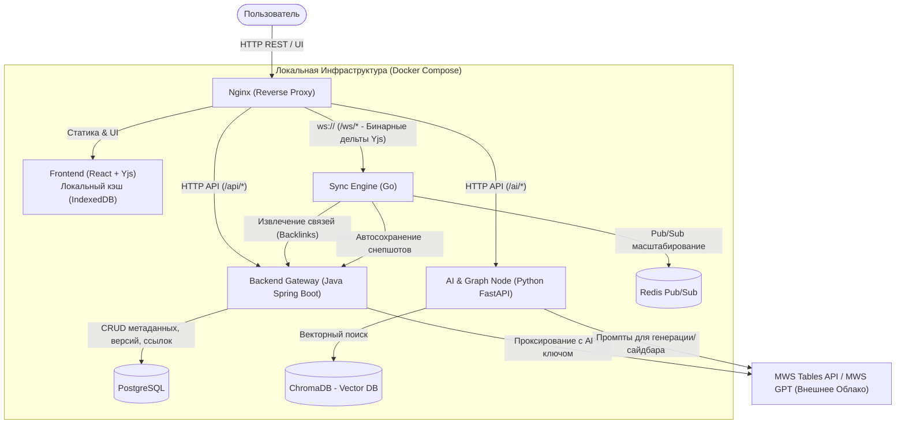
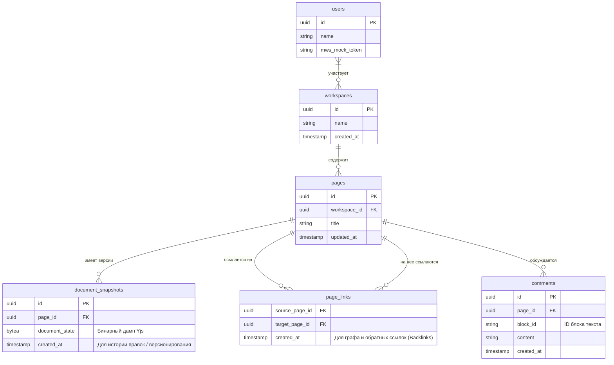
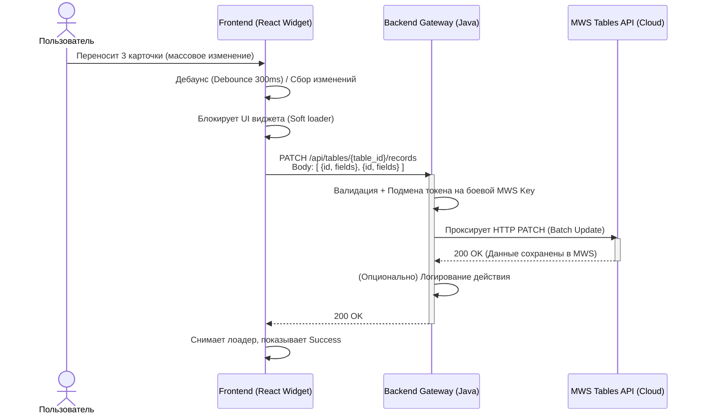
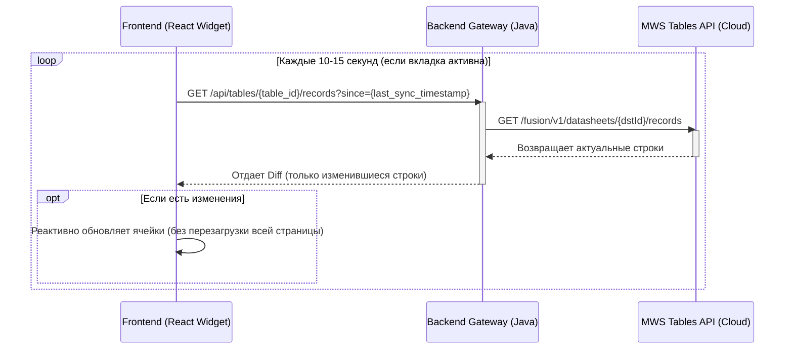

# Техническая спецификация проекта WikiLive (MWS Knowledge Fabric)

**WikiLive** — это локально развертываемая гибридная корпоративная вики-система. Проект сочетает в себе блочный CRDT-редактор текста в реальном времени (на базе Yjs + Tiptap/Lexical с MIT лицензией) и строгие реляционные данные, глубоко интегрируясь с облачным MWS Tables.

## 1. Топология Системы (C4 Model - Container Level)

Система спроектирована для надежного однострочного запуска через `docker-compose`, как требует регламент хакатона.

**Разделение ответственности:**
*   **Frontend (React):** Отрисовка UI по Design Kit, slash-menu, горячие клавиши. In-line сохранение в локальный кэш браузера при обрыве сети.
*   **Backend (Java):** Авторизация, управление воркспейсами, REST API таблиц (проксирование в MWS).
*   **Sync Engine (Go + Redis):** Обработка WebSockets, коллаборативное редактирование, парсинг ссылок внутри текста при сохранении (для графа и Backlinks).
*   **AI Node (Python):** Работа с MWS GPT, генерация блоков, анализ связей для графа.

---

## 2. Модель Данных (ERD PostgreSQL)

Схема расширена для поддержки обязательных требований (Backlinks) и дополнительных баллов (Версионирование, Комментарии).

*Примечание по наполнению `page_links`:* Когда Go Sync Engine сохраняет финальный дамп документа в БД, он асинхронно парсит текст/JSON на наличие паттернов ссылок `[[page_id]]` или `href="/page/{id}"` и дергает внутренний эндпоинт Java Gateway для обновления таблицы `page_links`.

---

## 3. Интеграция с MWS Tables: Массовое обновление (Sequence Diagram)

Флоу обновления ячеек таблицы внутри страницы. Использование метода `PATCH` для предотвращения спама запросами (учитываем массовое выделение или D&D).

---

## 4. Двусторонняя синхронизация: "Живая" таблица

Как фронтенд узнает, что данные в MWS Tables изменил кто-то другой (или другой сервис)? Т.к. вебхуков нет, реализуем Smart Polling (Опрос).

*Альтернатива:* Polling может делать Java Backend на своей стороне и при наличии изменений пушить их во Frontend через WebSocket (Go Sync Engine). Для хакатона вариант с фронтенд-поллингом (показан выше) надежнее и проще в реализации.
