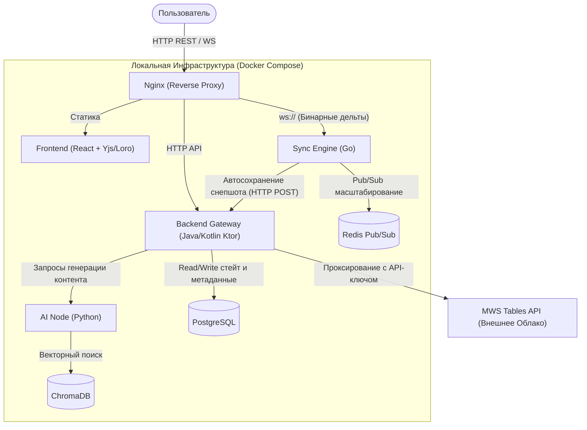
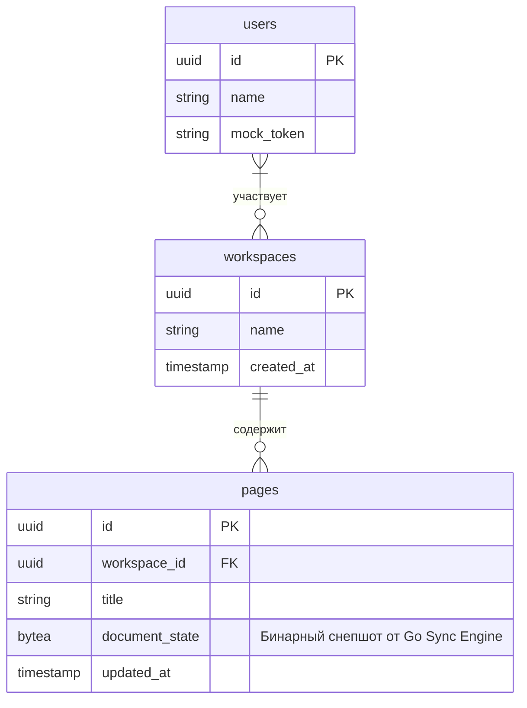
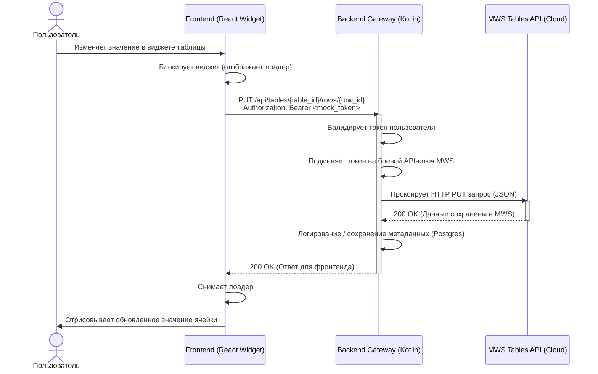

# Техническая спецификация проекта WikiLive (MWS Knowledge Fabric)

WikiLive — это локально развертываемая гибридная корпоративная вики-система. Проект сочетает в себе блочный CRDT-редактор текста в реальном времени (на базе Yjs/Loro) и строгие реляционные данные, интегрируясь с облачным MWS Tables.

Ниже представлена полная системная архитектура проекта, собранная для быстрого понимания инфраструктуры и информационных потоков.

---

## 1. Топология Системы (C4 Model - Container Level)

Общая схема взаимодействия контейнеров в пределах локального деплоя `docker-compose`:

---

## 2. Модель Данных (ERD PostgreSQL)

Минималистичная схема хранения метаданных и бинарных снепшотов для MVP:

---

## 3. Флоу обновления ячейки MWS (Sequence Diagram)

Самый сложный гибридный процесс системы: изменение данных во внешнем источнике (MWS Tables) непосредственно из текстового документа, минуя CRDT-движок.

---

*Спецификация API Backend шлюза выделена в отдельный файл `docs/openapi.yaml`.*
